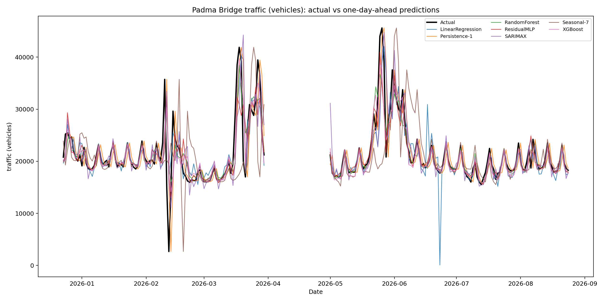
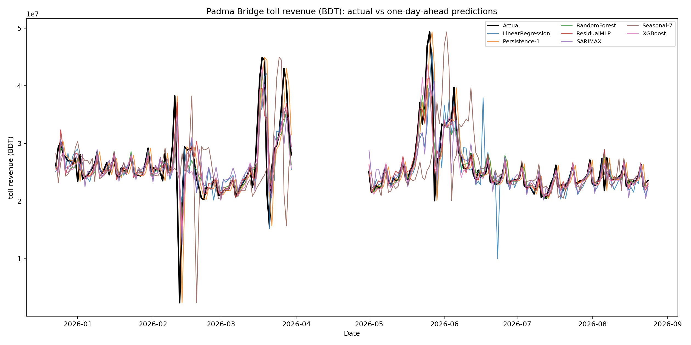
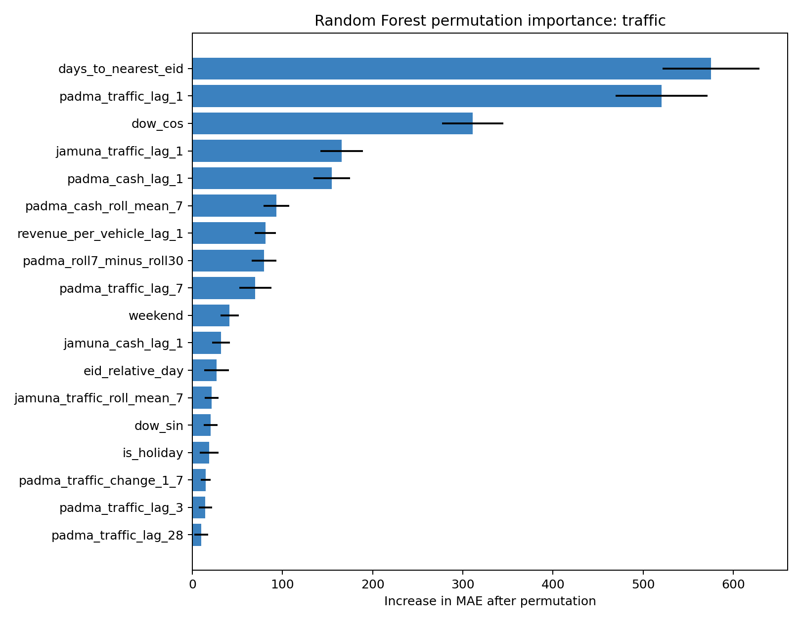

# Padma Bridge Traffic, Toll Revenue, and Impact Analysis

An end-to-end machine learning and econometric study of daily road traffic and toll revenue on Bangladesh's Padma Bridge. The project combines one-day-ahead forecasting, explainable machine learning, corridor-level time-series analysis, a railway intervention study, and a district-level nighttime-light analysis in one reproducible Python pipeline.

<p align="center">
  
</p>

## Project overview

The study addresses five related questions:

1. How accurately can the next day's Padma Bridge traffic and toll revenue be forecast?
2. How do weather, weekends, public holidays, and Eid periods affect traffic?
3. Do changes in Padma and Jamuna bridge traffic contain predictive information about one another?
4. Did the start of regular commercial rail service through the Padma Bridge coincide with a change in road traffic?
5. Did nighttime-light intensity evolve differently in southwestern districts after the bridge opened?

The forecasting comparison includes two naive baselines and five model families:

- Previous-day persistence and seven-day seasonal persistence
- Linear Regression
- Random Forest
- XGBoost
- SARIMAX with exogenous variables
- A custom two-branch Residual MLP implemented in PyTorch

The pipeline is designed to prevent target leakage: every traffic, toll, revenue-per-vehicle, and Jamuna-derived history feature is shifted by at least one day. Calendar and forecast-weather inputs are the only same-day features used for prediction.

## Key results

The figures below come from the saved full experiment. The untouched test period contains 214 days from 23 December 2025 through 24 August 2026.

### Forecasting performance

| Target | Model | MAE | RMSE | MAPE | R² |
|---|---|---:|---:|---:|---:|
| Traffic | **Random Forest** | **1,451 vehicles** | 2,963 | **8.58%** | 0.721 |
| Traffic | XGBoost | 1,454 vehicles | **2,876** | 9.09% | **0.738** |
| Traffic | Residual MLP | 1,530 vehicles | 3,150 | 8.66% | 0.685 |
| Toll revenue | **Residual MLP** | **BDT 1.52M** | BDT 3.00M | **9.47%** | 0.677 |
| Toll revenue | XGBoost | BDT 1.54M | **BDT 2.92M** | 9.56% | **0.693** |
| Toll revenue | Random Forest | BDT 1.63M | BDT 3.04M | 9.75% | 0.667 |

There is no single winner under every metric. Random Forest produces the lowest traffic MAE and MAPE, the Residual MLP produces the lowest toll MAE and MAPE, and XGBoost produces the lowest RMSE and highest R² for both targets. All three materially outperform the persistence baselines overall.

Performance is weaker during unusual demand periods. For example, the traffic Random Forest records 4.36% MAPE on normal days and 13.25% within the seven-day Eid window. Segment-level results for every model are available in the test metric tables.

### Interpretation highlights

- Eid proximity and recent bridge activity dominate the Random Forest's traffic importance. The leading permutation features are `days_to_nearest_eid`, one-day Padma traffic, day-of-week seasonality, one-day Jamuna traffic, and one-day Padma toll revenue.
- Adding Padma and Jamuna history to weather and calendar variables substantially improves traffic forecasts. In the feature ablation, MAE falls from 2,238 with weather/calendar features to 1,404 after Padma and Jamuna history are included.
- Padma and Jamuna log traffic changes show statistically strong bidirectional Granger-predictive relationships. This indicates temporal predictive information, not physical causation.
- The railway interrupted time-series model estimates no statistically significant immediate level change (-3.37%, p=0.460), but a negative post-intervention trend change (-0.0367% per day, p=0.005). This is an adjusted association, not a causal estimate.
- The nighttime-light DiD coefficient is -0.151 (p=0.034), but the pre-trend interaction is also significant (p=0.010). Because the parallel-trends assumption is questionable, this result should be treated as descriptive rather than causal.

<p align="center">
  
</p>

## Data

The project uses three non-duplicative CSV inputs in `data/raw/`:

| File | Coverage | Purpose |
|---|---|---|
| `padma_toll_report_with_holidays_weather.csv` | 1,520 daily records, 2022-06-26 to 2026-08-24 | Padma traffic, tolls, holidays, Eid, and weather |
| `jamuna_toll_report.csv` | 1,515 daily records, 2022-07-01 to 2026-08-24 | Jamuna traffic and toll history |
| `bangladesh_ntl_2019_2025_padma_groups.csv` | 5,376 rows; 64 districts × 84 months | Nighttime-light treatment/control panel |

The data pipeline handles Indian-style digit grouping and malformed punctuation in numeric fields. Published totals are retained even when side-level values do not add up; all discrepancies and missing dates are recorded in `outputs/reports/data_audit.json` rather than silently corrected.

After daily reindexing and lag construction, 1,425 complete rows and 51 predictors are available for forecasting.

## Methodology

### Feature engineering

The model matrix contains:

- Cyclical day-of-week, month, and day-of-year encodings
- Weekend, public-holiday, Eid, and signed Eid-relative indicators
- Temperature, rainfall, humidity, wind, rainy-day, and heavy-rain variables
- Railway-opening level and trend indicators
- Padma traffic and toll lags at multiple horizons
- Shifted 7-, 14-, and 30-day rolling statistics and trend differences
- Shifted revenue-per-vehicle features
- Lagged and rolling Jamuna bridge traffic and toll features

### Evaluation protocol

Rows are split chronologically, never randomly:

| Partition | Dates | Rows | Use |
|---|---|---:|---|
| Train | 2022-07-31 to 2025-04-22 | 997 | Model fitting and expanding-window tuning |
| Validation | 2025-04-23 to 2025-12-22 | 214 | Model-family comparison and epoch/order selection |
| Test | 2025-12-23 to 2026-08-24 | 214 | One final evaluation |

Random Forest and XGBoost use expanding-window `TimeSeriesSplit` tuning within the training period. Selected configurations are refitted on train plus validation data before test evaluation. SARIMAX is evaluated walk-forward, and the Residual MLP is retrained as a three-seed ensemble after validation determines the epoch count.

Test rows may use actual observations from preceding test days, matching an operational one-day-ahead workflow in which yesterday's completed toll record is known before today's forecast.

### Residual MLP

The custom neural network predicts the change from yesterday rather than the raw level:

```text
External features ──> 32 ──> 16 ──┐
                                  ├──> 32 ──> 16 ──> predicted change
History features  ──> 64 ──> 32 ──┘

prediction(t) = observed target(t-1) + predicted change(t)
```

It uses GELU activations, dropout, AdamW, Huber loss, early stopping, feature standardization, and a three-seed ensemble.

### Statistical and impact analyses

- **Weather and events:** Spearman correlations, grouped comparisons, and a signed ±14-day Eid event profile.
- **Padma–Jamuna dynamics:** ADF tests, log-first-difference cross-correlation, bidirectional Granger tests up to 14 days, AIC-selected VAR, and 14-day impulse responses.
- **Railway intervention:** Interrupted time-series regression using the 1 November 2023 commercial-service start, calendar/weather controls, and seven-day HAC standard errors; a lag-adjusted sensitivity model is also saved.
- **Nighttime lights:** Difference-in-Differences with district and month fixed effects, district-clustered standard errors, and an explicit pre-trend test.

## Repository structure

```text
padma_bridge_ml_complete/
├── data/
│   ├── raw/                    # Three source CSV files
│   └── processed/              # Generated daily, modeling, and NTL tables
├── models/                     # Saved RF, XGBoost, linear, SARIMAX, and MLP models
├── outputs/
│   ├── figures/                # Forecast, importance, event, VAR, ITS, and DiD plots
│   ├── reports/                # Audits, summaries, and model reports
│   ├── tables/                 # Metrics, predictions, tuning, and analysis tables
│   └── run_summary.json        # Machine-readable summary of the complete run
├── src/
│   ├── config.py               # Paths, feature lists, targets, and intervention dates
│   ├── data_pipeline.py        # Parsing, auditing, alignment, and feature engineering
│   ├── forecasting.py          # Training, tuning, walk-forward prediction, evaluation
│   ├── metrics.py              # Overall and event-segment regression metrics
│   ├── explainability.py       # Importance, SHAP, ablation, and event analyses
│   ├── time_series_analysis.py # Padma–Jamuna ADF, Granger, VAR, and IRF analysis
│   └── impact_analysis.py      # Railway ITS and nighttime-light DiD
├── tests/test_data_pipeline.py # Numeric-parser and leakage-safety checks
├── Padma_Bridge_Complete_Colab.ipynb
├── predict_next_day.py         # Strict next-day inference CLI
├── run_all.py                  # Eleven-stage pipeline entry point
└── requirements.txt
```

## Installation

Python 3.10 or newer is recommended. A CUDA-capable GPU is optional and only benefits the PyTorch Residual MLP.

```bash
git clone <repository-url>
cd padma_bridge_ml_complete
python -m venv .venv
```

Activate the environment:

```bash
# Linux/macOS
source .venv/bin/activate

# Windows PowerShell
.venv\Scripts\Activate.ps1
```

Install the dependencies:

```bash
python -m pip install --upgrade pip
pip install -r requirements.txt
```

## Usage

### Run the tests

```bash
# Linux/macOS
PYTHONPATH=. python tests/test_data_pipeline.py

# Windows PowerShell
$env:PYTHONPATH = "."; python tests/test_data_pipeline.py
```

The tests validate the nonstandard number parsers, confirm shifted lag and rolling calculations, and ensure target-day Padma fields are excluded from the feature list.

### Run a smoke test

```bash
python run_all.py --quick
```

Quick mode reduces the hyperparameter search and model-training effort. It is intended to verify the environment and pipeline, not to produce reportable final results.

### Reproduce the full study

```bash
python run_all.py
```

The eleven stages rebuild processed datasets, train both forecasting targets, generate model explanations and ablations, run the event and time-series analyses, execute both impact studies, and refresh `outputs/run_summary.json`.

To read the input files from another location:

```bash
python run_all.py --data-dir /path/to/csv-directory
```

Each stage is isolated by the runner so an optional analysis can report a failure without hiding successful outputs from other stages. Dataset construction remains mandatory because all downstream work depends on it.

### Google Colab

Upload this folder to Google Drive, open `Padma_Bridge_Complete_Colab.ipynb`, mount Drive, change into the project directory, and install `requirements.txt`. A typical setup is:

```python
from google.colab import drive
drive.mount('/content/drive')
%cd /content/drive/MyDrive/padma_bridge_ml_complete
!pip -q install -r requirements.txt
!python run_all.py --quick
```

After the smoke test succeeds, run `!python run_all.py` for the final experiment. A T4 runtime is optional.

## Next-day prediction

`predict_next_day.py` loads the saved final Random Forest bundles and forecasts exactly one day after the most recent observed Padma record. This strict date check prevents multi-day prediction from using unknown lag values as if they were observed.

```bash
python predict_next_day.py \
  --date 2026-08-25 \
  --temp-mean 29.2 \
  --temp-max 33.1 \
  --temp-min 26.4 \
  --rainfall 4.5 \
  --humidity 82 \
  --wind-speed 11.0 \
  --is-holiday 0 \
  --eid 0 \
  --days-to-eid 88 \
  --eid-relative-day 88
```

Replace the example calendar and weather values with information genuinely available before the forecast date. To predict a later date, append the intervening observed records and rerun the pipeline first.

## Outputs

The most useful artifacts are:

| Artifact | Description |
|---|---|
| `outputs/tables/traffic_test_metrics.csv` | Overall, normal-day, holiday, and Eid-window traffic scores |
| `outputs/tables/toll_test_metrics.csv` | Equivalent toll-revenue scores |
| `outputs/tables/*_test_predictions.csv` | Date-level actual and predicted values |
| `outputs/tables/*_rf_permutation_importance.csv` | Held-out permutation importance |
| `outputs/tables/*_feature_ablation.csv` | Incremental feature-family comparisons |
| `outputs/reports/data_audit.json` | Missing dates, total mismatches, row counts, and leakage policy |
| `outputs/reports/padma_jamuna_summary.json` | VAR selection and minimum Granger p-values |
| `outputs/reports/railway_its_summary.json` | Railway level/trend estimates and caveat |
| `outputs/reports/ntl_did_summary.json` | DiD estimate, confidence interval, and pre-trend warning |

<p align="center">
  
</p>

## Reproducibility and limitations

- Randomized components use fixed seeds; MLP results are averaged across seeds 1, 7, and 42.
- Forecast performance depends on the quality of same-day weather forecasts supplied at inference time.
- MAPE can be unstable near zero; MAE is the primary selection metric and RMSE is used to assess large errors.
- Regression “accuracy” is not a classification accuracy percentage. If needed for presentation, `100 − MAPE` must be labeled as an MAPE-derived approximation.
- Holiday and Eid subsets are small and more volatile than ordinary days; segment estimates should be interpreted with their sample sizes.
- Feature importance measures predictive contribution, not causal effect. Correlated lag features may share importance.
- Granger tests identify lead–lag predictability, not a physical causal mechanism.
- The railway analysis has no road-corridor control group or train-passenger series, so its coefficients are adjusted temporal associations.
- The NTL parallel-trends warning prevents a strong causal interpretation of the reported DiD estimate.
- The raw source tables contain reported-total inconsistencies. The audit preserves transparency, but upstream data quality remains a limitation.

## Data and contextual sources

- [Bangladesh Bridge Authority](https://bba.gov.bd/)
- [Open-Meteo Historical Weather API](https://open-meteo.com/en/docs/historical-weather-api)
- [Padma Bridge Rail Link Project](https://pbrlp.gov.bd/)
- [World Bank Space2Stats Nighttime Lights catalog](https://datacatalog.worldbank.org/search/dataset/0066940/space2stats-monthly-annual-black-marble-nighttime-lights)

## License and citation

No license or citation file is currently included. Before public redistribution, add the intended software license and verify the reuse terms and attribution requirements for each source dataset.
